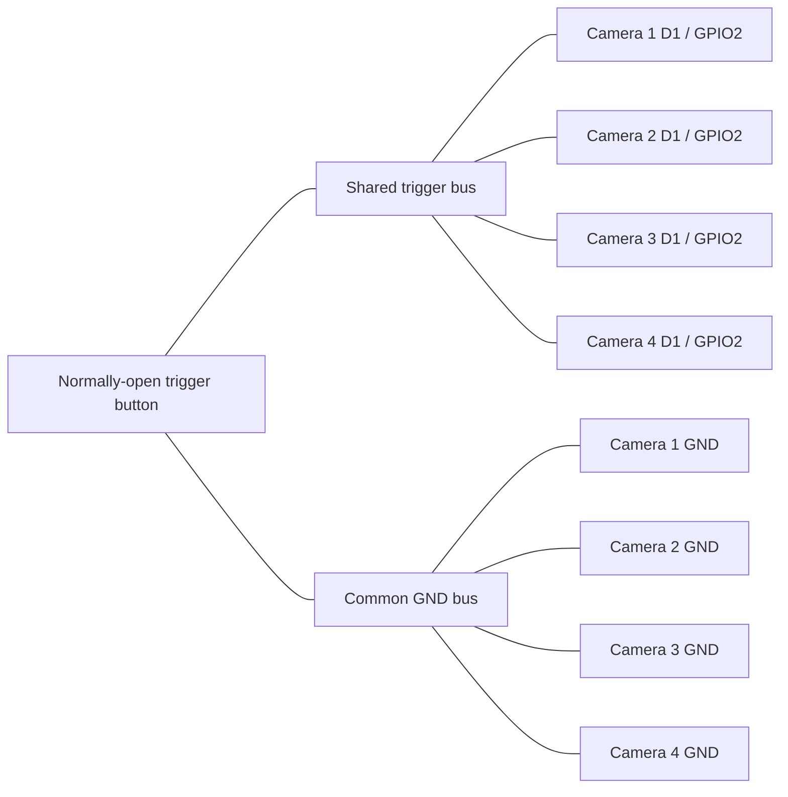
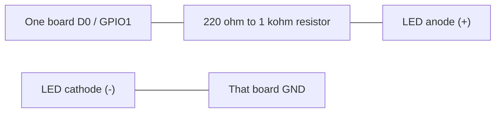

# Handheld Four-Camera Bullet-Time Rig

<p align="center">
  
</p>

This project is building a production-like, self-contained bullet-time camera: a fairly compact handheld device with four camera viewpoints, an integrated screen, a physical shutter button, a central processor, removable media storage, and an internal rechargeable battery.

Each camera is managed by its own Seeed Studio XIAO ESP32S3 Sense and OV3660 sensor. A central computer—currently expected to be a Raspberry Pi 4 Model B or similar—will collect each four-image capture, improve and align the images, and create an animated GIF that moves through the viewpoints. The central computer will also run the on-device interface and may eventually host a Wi-Fi hotspot for browsing and downloading finished media.

The first complete rig has four cameras spaced approximately 4 cm apart in a straight horizontal line and is held like a normal digital camera. Its typical subject distance is about 3.5 ft, although other distances should remain usable. The initial output will play the four nearly simultaneous photographs forward and backward, making the viewpoint appear to move while the scene remains frozen. A reviewable result should normally reach the built-in screen within two seconds.

The longer-term ideal is a scalable 12+ camera system. A larger array will use a slight curve to aim its outer cameras toward the subject. Later processing may add view alignment, appearance matching, AI frame interpolation, and experiments with NeRF or 3D Gaussian Splatting.

Version 1 deliberately performs no alignment or appearance normalization: it transfers the four original JPEGs, preserves them, creates the simple animated GIF, and preserves that GIF as well. Image-quality processing begins after the complete capture-to-display system works reliably.

The accepted version 1 display remains blank during the early Raspberry Pi kernel phase, then shows only `assets/Logo_800x480.png` and hands directly to the full-screen camera application without exposing firmware artwork, boot logs, a desktop, login prompt, cursor, or startup diagnostics. The application shows a capture/loading screen while a shot is in progress, then displays the completed animation until the next shot begins. It has no gallery, deletion controls, live preview, or user-adjustable camera settings. Live preview is the first planned follow-up; camera settings are deferred to version 2. A touchscreen is likely, but the project will use whichever Raspberry Pi-compatible display/control option is simplest to integrate.

The Raspberry Pi will boot from a protected internal card. Original JPEGs and generated GIFs will be written to a separate user-removable media card, keeping the operating system isolated from normal media handling.

Version 1 requires an internal rechargeable battery and USB-C charging, but it does not need to operate while charging. One power button must safely boot and shut down the complete device. A low battery must initiate the same orderly shutdown before a brownout can corrupt storage or interrupt writes. Final battery capacity will be chosen after measuring the assembled system, with the goal of long runtime and many captures per charge.

The first enclosure will be a reasonably compact, box-shaped 3D print with openings for every externally accessible component. Refined ergonomics, weight optimization, integrated lighting, tripod mounting, and weather resistance are deliberately deferred until later physical revisions.

Version 1 degrades gracefully when a camera fails: it preserves and processes the images received from the remaining nodes instead of discarding the entire capture. The screen reports the failed camera number and relevant diagnostics. The two-second result goal is a soft normal-case target; the loading screen may remain longer while capture, transfer, or saving is actively progressing.

USB and Wi-Fi are the two candidate links between the camera nodes and central computer. USB is the leading option for the first four-camera build because of its predictable latency and reliability, while Wi-Fi remains an alternate path worth prototyping, especially for future scaling. The preferred final data path transfers each JPEG directly from node memory to the central computer instead of requiring four node microSD cards.

User-facing Wi-Fi features are deliberately much later. Hotspot-based media access, remote capture, status, and settings will wait until the self-contained onboard experience is highly polished.

The long-term product goal and current decisions are maintained in:

- [`docs/PROJECT_CONTEXT.md`](docs/PROJECT_CONTEXT.md)
- [`docs/INTERVIEW.md`](docs/INTERVIEW.md)
- [`docs/ROADMAP.md`](docs/ROADMAP.md)
- [`docs/MILESTONE_1_PLAN.md`](docs/MILESTONE_1_PLAN.md)
- [`docs/CURRENT_SESSION.md`](docs/CURRENT_SESSION.md) - live status for the active Checkpoint 4 implementation session
- [`docs/RASPBERRY_PI_SSH.md`](docs/RASPBERRY_PI_SSH.md)
- [`docs/RASPBERRY_PI_BOOT_RUNBOOK.md`](docs/RASPBERRY_PI_BOOT_RUNBOOK.md) - reproduce, verify, recover, or roll back the accepted product boot state

## Current Project State

As of July 17, 2026, with capture-path bench evidence recorded July 11 and product-boot evidence recorded July 17:

The four-camera capture subsystem is working as a breadboard prototype:

- Four XIAO ESP32S3 Sense modules are fitted with OV3660 sensors and 16 GB microSD cards.
- All four nodes share one physical shutter button.
- Every node has its own status LED.
- The boards are currently powered over USB from a battery hub.
- One button press causes each node to capture and save its own image to its local microSD card.
- The Raspberry Pi 4 Model B with 2 GB RAM has been imaged and boots Raspberry Pi OS successfully with the intended 800x480 HDMI display.
- Touch input on the intended display works.
- The accepted product boot path is visually verified: blank early boot, product logo, then the full-screen camera application, with no visible OS/debug text, desktop chrome, login prompt, or pointer.
- The display uses HDMI video and a micro-USB connection for touch and/or display-side power.
- A powered USB hub is available for bench testing and has identified one ESP32 camera node as expected from the Raspberry Pi, confirming that the hub carries USB data for at least one node.
- A 3D printer is available for a later enclosure stage.
- The final integrated USB hub/cabling choice, integrated battery system, and separate removable-media card reader have not yet been selected.

The repository now contains the camera-node firmware plus a Raspberry Pi receiver/UI, CRC-protected USB protocol, manifest and atomic-storage path, instrumentation, seven passing protocol tests, smoke-test and analytics tools, a user-service definition, and project logo assets under `assets/`. The one-node USB-request-to-touchscreen path works through the powered hub. Multi-image GIF generation, four-node grouping, consolidated removable storage, internal power, and the handheld enclosure remain to be built.

The active Milestone 1 checkpoint is now a one-node full-system bench test through the available powered USB hub: capture request, direct frame-buffer JPEG transfer to the Raspberry Pi, verified preservation, representative processing, and touchscreen display. Because the physical button is not presently wired into this one-node setup, the Pi touchscreen temporarily sends a framed USB capture request; the shared physical-trigger path remains in firmware and still requires later validation. The test records per-stage latency, integrity, resource use, reconnect, and failure evidence before scaling the same path to four nodes. Earlier offline and isolated-transfer checkpoints are deferred rather than marked complete. With approximately $200 remaining for version 1, battery and enclosure work remain deferred until the central path is working and measured.

Development is milestone-based with no fixed version 1 deadline.

The latest one-node evidence includes a clean 20-capture run with zero checksum failures or partial files, plus a live deliberately corrupted payload that produced a targeted NACK, visible touchscreen error, no committed/partial image, and an immediately successful normal recovery capture. Median normal capture-event-to-display callback was 2.494 seconds. Camera acquisition and USB transfer account for most of that latency. See [`docs/CURRENT_SESSION.md`](docs/CURRENT_SESSION.md) and the evidence recorded in [`docs/MILESTONE_1_PLAN.md`](docs/MILESTONE_1_PLAN.md).

## Raspberry Pi Development Access

The current bench Pi is reachable over key-based SSH from the local Windows account configured for this project:

```powershell
ssh camerapi
```

The alias currently targets Pi hostname `camerapi`, LAN address `10.0.0.136`, and Linux user `username`. Strict host-key checking and a dedicated identity are configured in the Windows user's SSH profile. The private key is stored at `C:\Users\tyler\.ssh\camerapi_ed25519`, outside this repository; never copy it into the project or rely on `.gitignore` to protect it.

Local Codex agents running under the same Windows account can use the alias, subject to network approval. Other machines and cloud-hosted agents do not automatically receive the key. See [`docs/RASPBERRY_PI_SSH.md`](docs/RASPBERRY_PI_SSH.md) for the verified fingerprint, key-only test command, security boundary, and recovery/rotation procedure.

## Planned System

| Subsystem | Responsibility | State |
| --- | --- | --- |
| Four ESP32S3 camera nodes | Capture four initial viewpoints and report status | Working breadboard prototype |
| Shared shutter control | Start one coordinated capture | Working breadboard prototype |
| Central computer | Collect captures and coordinate the complete device | Raspberry Pi 4B validated for one-node vertical slice; four-node suitability remains provisional |
| Processing pipeline | Preserve originals and create the version 1 animation | One-image representative processing implemented; four-image GIF pending |
| Integrated screen and UI | V1 status and post-capture review; preview/settings later | One-node loading/review/error flow implemented; four-node integration pending |
| Central removable storage | Store user-accessible photos and GIFs | Atomic Pi-side capture persistence implemented; separate removable media pending |
| Internal battery system | Power and recharge the complete device | Planned |
| Wi-Fi media access | Let phones and laptops browse/download results | Optional later stage |
| Compact handheld enclosure | Turn the prototype into one finished physical product | Planned |
| Scalable camera array | Expand the architecture toward 12+ slightly curved viewpoints | Future |

## Current Camera-Node Firmware

The same Arduino sketch is flashed to all four camera nodes. A shared momentary trigger on `D1 / GPIO2` captures one high-quality 2048x1536 JPEG on each board and saves it to that board's onboard microSD card. An external LED on each board's `D0 / GPIO1` turns on before capture and stays visible for at least one second.

For the active one-node bench test, the same capture routine can also be requested by a framed `CAPTURE_REQUEST` over USB. The captured JPEG is streamed directly from the frame buffer to the Pi with CRC protection and Pi-side acknowledgement; microSD saving remains a separate backup path. The USB request is temporary test scaffolding until the physical button is connected to the bench setup.

The Pi receiver/UI, protocol tests, runtime requirements, bounded serial smoke test, and user-service definition are under [`pi_app/`](pi_app/).

This gives practical same-button synchronization: all four boards see the same active-low trigger and start their capture sequence nearly together. It is not sensor-level hardware shutter sync; the OV3660 sensors still free-run independently, so exact exposure timing can vary by roughly a camera frame.

## Wiring Four Cameras

Flash the same sketch to all four modules.

Use a normally-open pushbutton between the shared `D1 / GPIO2` trigger bus and the common `GND` bus. The sketch enables the ESP32 internal pull-up on every board, so no external resistor is required for the trigger. Four internal pull-ups in parallel are still light enough for a normal pushbutton.

Connect all four board grounds together. This common ground is required even if the boards are powered from separate USB cables.

### Circuit Summary

| Net | Connects To | Notes |
| --- | --- | --- |
| `TRIGGER` | All four `D1 / GPIO2` pins and one side of the pushbutton | Idle `HIGH` through each board's internal pull-up |
| `GND` | All four `GND` pins and the other side of the pushbutton | Required for a shared logic reference |
| `STATUS_LED_1..4` | Each board's own `D0 / GPIO1`, resistor, LED, and that board's `GND` | Optional; do not connect the four `D0` pins together |
| `5V` power | Each board's USB-C port or each board's `5V` pin from one regulated supply | Keep `3V3` rails separate unless you have a deliberate shared-power design |



- Trigger unpressed reads `HIGH`.
- Trigger pressed reads `LOW`.
- Keep the trigger wiring short or route it as a twisted pair with ground if the cameras are spread out.
- If one board is powered off while the others are on, disconnect it from the trigger bus or power all boards together to avoid weak backfeed through GPIO protection paths.
- Do not tie the `3V3` rails together when boards are powered from separate USB cables.
- If using one external supply, use a regulated 5V supply sized for all four boards and wire 5V/GND in a star layout rather than daisy-chaining through the boards.
- Do not use `D8`, `D9`, or `D10` for the trigger; the Sense microSD slot uses those SPI pins.
- Do not use the onboard/user LED for status; on the Sense board, `GPIO21` is also the microSD chip-select used by `SD.begin(21)`.
- Insert a FAT32 microSD card, up to 32 GB, into each Sense expansion board before booting.

For optional status LEDs, wire each board separately. Do not tie the four `D0 / GPIO1` pins together.



- Status LED on: that board's `GPIO1` drives `HIGH`.
- Status LED off: that board's `GPIO1` drives `LOW`.

### Four-Board Checklist

- Flash this same sketch to Camera 1, Camera 2, Camera 3, and Camera 4.
- Put a FAT32 microSD card in each Sense expansion board.
- Connect all four `D1 / GPIO2` pins to the same trigger bus.
- Connect the trigger pushbutton between the trigger bus and common ground.
- Connect all four `GND` pins to the common ground bus.
- Power all four boards before pressing the trigger.
- Start with empty cards if you want matching filenames, such as `photo_0001.jpg`, across all four cameras.

## Load With Arduino IDE

1. Install Arduino IDE 2.x.
2. Open `File > Preferences`.
3. Add this Boards Manager URL:
   `https://raw.githubusercontent.com/espressif/arduino-esp32/gh-pages/package_esp32_index.json`
4. Open `Tools > Board > Boards Manager`, search for `esp32`, and install Espressif `esp32` version `2.0.8` or newer.
5. Select `Tools > Board > esp32 > XIAO_ESP32S3`.
6. Enable PSRAM in the board/tool settings.
7. Select the XIAO serial port.
8. Open `button_capture/button_capture.ino`.
9. Upload the sketch, then open Serial Monitor at `115200`.
10. Press the shared trigger button. Each board's status LED turns on, the cameras settle briefly, and one image is captured and saved per board. Files are saved as `/photos/photo_0001.jpg`, `/photos/photo_0002.jpg`, and so on. Empty cards in all four boards will produce matching photo numbers.

## Build And Upload With Arduino CLI

These commands are for Windows PowerShell. They build and upload the `button_capture` sketch with OPI PSRAM enabled, which is required for high-resolution camera captures.

If Arduino CLI is installed in the user-local CodexTools path used for this project:

```powershell
$ArduinoCli = "$env:LOCALAPPDATA\CodexTools\arduino-cli\arduino-cli.exe"
```

If Arduino CLI is installed globally and already on `PATH`, use this instead:

```powershell
$ArduinoCli = "arduino-cli"
```

Set the board package URL, board target, and sketch path:

```powershell
$Esp32Url = "https://raw.githubusercontent.com/espressif/arduino-esp32/gh-pages/package_esp32_index.json"
$Fqbn = "esp32:esp32:XIAO_ESP32S3:PSRAM=opi"
$Sketch = ".\button_capture"
```

Install or update the ESP32 Arduino core:

```powershell
& $ArduinoCli core update-index --additional-urls $Esp32Url
& $ArduinoCli core install esp32:esp32 --additional-urls $Esp32Url
```

Discover the connected board port:

```powershell
& $ArduinoCli board list
[System.IO.Ports.SerialPort]::GetPortNames()
```

If no COM port appears, unplug the XIAO, hold `BOOT`, plug USB back in, release `BOOT`, then run the port discovery commands again.

Build the sketch:

```powershell
& $ArduinoCli compile --fqbn $Fqbn $Sketch
```

Upload the sketch, replacing `COM3` with the port found above:

```powershell
$Port = "COM3"
& $ArduinoCli upload -p $Port --fqbn $Fqbn $Sketch
```

Open the serial monitor:

```powershell
& $ArduinoCli monitor -p $Port -c baudrate=115200
```

Optional PlatformIO port discovery, if PlatformIO is installed:

```powershell
$Pio = "$env:LOCALAPPDATA\CodexTools\platformio-venv\Scripts\pio.exe"
& $Pio device list
```

### Deploy With the Repository Skill

Codex can use the repo-scoped `$deploy-xiao-esp32s3-sense` skill to discover one attached ESP32 device, compile with the required OPI PSRAM setting, upload the sketch, and verify camera, microSD, and trigger startup over serial.

The bundled helper can also be run directly from the repository root:

```powershell
powershell -NoProfile -ExecutionPolicy Bypass -File ".agents\skills\deploy-xiao-esp32s3-sense\scripts\deploy_xiao.ps1"
```

Pass `-Port COM6` when more than one ESP32 serial device is attached. A successful upload is not treated as a complete deployment unless the serial startup checks also pass.

## Image Quality Notes

- The sketch captures the OV3660's native 4:3 `2048x1536` frame. Crop or downsample the saved JPEG on a computer if you need a cleaner `1920x1080` final image.
- `JPEG_QUALITY` is set to `8`; in the ESP32 camera driver, lower numbers mean less JPEG compression and larger files.
- The capture path uses one frame buffer, waits `700 ms`, discards four warm-up frames, then saves the next frame so exposure and white balance have time to settle.
- Sensor denoise, mild sharpening, defect correction, gamma, auto white balance, and auto exposure are enabled. Gain is capped at `GAINCEILING_4X` to reduce noise.
- If photos are too dark after the gain cap, add more steady diffuse light first. If that is not possible, try `GAINCEILING_8X`, but expect more grain.
- Clean the lens, remove any protective film, and keep the camera rigidly mounted while capturing.
- Use stable 5V power for all four boards; high-resolution capture plus microSD writes can be current-sensitive.

## Expected Serial Output

On successful boot:

```text
XIAO ESP32S3 Sense 4-Camera Shared Trigger
Testing status LED...
Initializing camera...
Camera ready: 2048x1536 JPEG, quality 8.
Initializing microSD...
microSD ready: /photos, next file photo_0001.jpg.
Ready. Pull the shared trigger LOW to capture.
```

On capture:

```text
Capturing photo...
Saved /photos/photo_0001.jpg (2048x1536, 123456 bytes)
```

## Validation

- Boot without a card: Serial should report an SD failure.
- Boot with a FAT32 card: Serial should report ready.
- Press once: one JPEG should be created on each of the four cards.
- Hold the trigger: only one JPEG should be created per board for that press.
- Watch the status LED: it should turn on for at least one second per capture, even if the capture/save finishes quickly.
- Press repeatedly: filenames should increment without overwriting.
- Check the files on a computer: each image should open as 2048x1536.
- If one board misses a trigger, check that its `D1 / GPIO2` pin joins the same trigger bus and that its `GND` pin joins the common ground bus.
