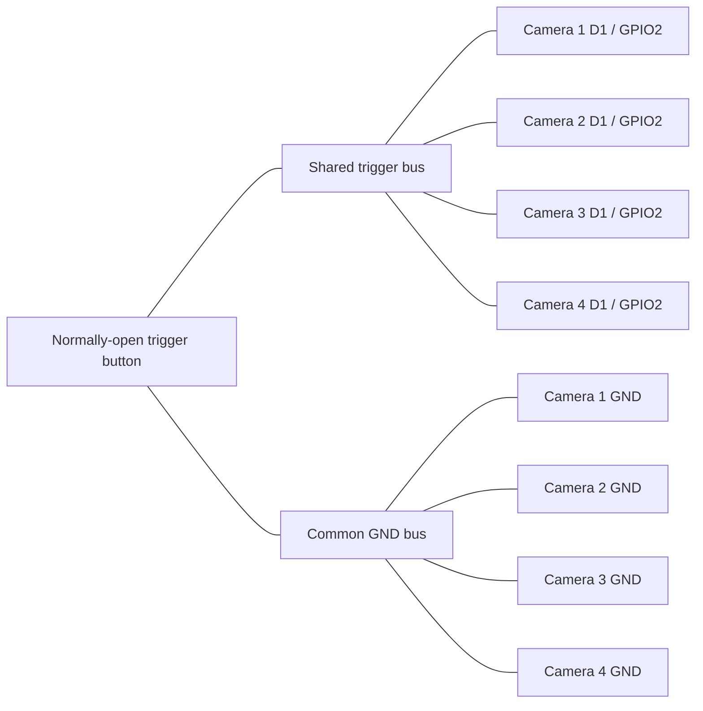
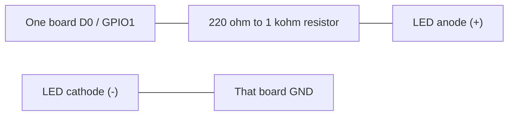

# XIAO ESP32S3 Sense Four-Camera Shared Trigger

Arduino firmware for a four-camera Seeed Studio XIAO ESP32S3 Sense rig using the OV3660 camera. The same sketch is flashed to all four boards. A shared momentary trigger on `D1 / GPIO2` captures one high-quality 2048x1536 JPEG on each board and saves it to that board's onboard microSD card. An optional external LED on each board's `D0 / GPIO1` turns on before capture and stays visible for at least one second.

This gives practical same-button synchronization: all four boards see the same active-low trigger and start their capture sequence nearly together. It is not sensor-level hardware shutter sync; the OV3660 sensors still free-run independently, so exact exposure timing can vary by roughly a camera frame.

## Wiring Four Cameras

Flash the same sketch to all four modules.

Use a normally-open pushbutton between the shared `D1 / GPIO2` trigger bus and the common `GND` bus. The sketch enables the ESP32 internal pull-up on every board, so no external resistor is required for the trigger. Four internal pull-ups in parallel are still light enough for a normal pushbutton.

Connect all four board grounds together. This common ground is required even if the boards are powered from separate USB cables.

### Circuit Summary

| Net | Connects To | Notes |
| --- | --- | --- |
| `TRIGGER` | All four `D1 / GPIO2` pins and one side of the pushbutton | Idle `HIGH` through each board's internal pull-up |
| `GND` | All four `GND` pins and the other side of the pushbutton | Required for a shared logic reference |
| `STATUS_LED_1..4` | Each board's own `D0 / GPIO1`, resistor, LED, and that board's `GND` | Optional; do not connect the four `D0` pins together |
| `5V` power | Each board's USB-C port or each board's `5V` pin from one regulated supply | Keep `3V3` rails separate unless you have a deliberate shared-power design |



- Trigger unpressed reads `HIGH`.
- Trigger pressed reads `LOW`.
- Keep the trigger wiring short or route it as a twisted pair with ground if the cameras are spread out.
- If one board is powered off while the others are on, disconnect it from the trigger bus or power all boards together to avoid weak backfeed through GPIO protection paths.
- Do not tie the `3V3` rails together when boards are powered from separate USB cables.
- If using one external supply, use a regulated 5V supply sized for all four boards and wire 5V/GND in a star layout rather than daisy-chaining through the boards.
- Do not use `D8`, `D9`, or `D10` for the trigger; the Sense microSD slot uses those SPI pins.
- Do not use the onboard/user LED for status; on the Sense board, `GPIO21` is also the microSD chip-select used by `SD.begin(21)`.
- Insert a FAT32 microSD card, up to 32 GB, into each Sense expansion board before booting.

For optional status LEDs, wire each board separately. Do not tie the four `D0 / GPIO1` pins together.



- Status LED on: that board's `GPIO1` drives `HIGH`.
- Status LED off: that board's `GPIO1` drives `LOW`.

### Four-Board Checklist

- Flash this same sketch to Camera 1, Camera 2, Camera 3, and Camera 4.
- Put a FAT32 microSD card in each Sense expansion board.
- Connect all four `D1 / GPIO2` pins to the same trigger bus.
- Connect the trigger pushbutton between the trigger bus and common ground.
- Connect all four `GND` pins to the common ground bus.
- Power all four boards before pressing the trigger.
- Start with empty cards if you want matching filenames, such as `photo_0001.jpg`, across all four cameras.

## Load With Arduino IDE

1. Install Arduino IDE 2.x.
2. Open `File > Preferences`.
3. Add this Boards Manager URL:
   `https://raw.githubusercontent.com/espressif/arduino-esp32/gh-pages/package_esp32_index.json`
4. Open `Tools > Board > Boards Manager`, search for `esp32`, and install Espressif `esp32` version `2.0.8` or newer.
5. Select `Tools > Board > esp32 > XIAO_ESP32S3`.
6. Enable PSRAM in the board/tool settings.
7. Select the XIAO serial port.
8. Open `button_capture/button_capture.ino`.
9. Upload the sketch, then open Serial Monitor at `115200`.
10. Press the shared trigger button. Each board's status LED turns on, the cameras settle briefly, and one image is captured and saved per board. Files are saved as `/photos/photo_0001.jpg`, `/photos/photo_0002.jpg`, and so on. Empty cards in all four boards will produce matching photo numbers.

## Build And Upload With Arduino CLI

These commands are for Windows PowerShell. They build and upload the `button_capture` sketch with OPI PSRAM enabled, which is required for high-resolution camera captures.

If Arduino CLI is installed in the user-local CodexTools path used for this project:

```powershell
$ArduinoCli = "$env:LOCALAPPDATA\CodexTools\arduino-cli\arduino-cli.exe"
```

If Arduino CLI is installed globally and already on `PATH`, use this instead:

```powershell
$ArduinoCli = "arduino-cli"
```

Set the board package URL, board target, and sketch path:

```powershell
$Esp32Url = "https://raw.githubusercontent.com/espressif/arduino-esp32/gh-pages/package_esp32_index.json"
$Fqbn = "esp32:esp32:XIAO_ESP32S3:PSRAM=opi"
$Sketch = ".\button_capture"
```

Install or update the ESP32 Arduino core:

```powershell
& $ArduinoCli core update-index --additional-urls $Esp32Url
& $ArduinoCli core install esp32:esp32 --additional-urls $Esp32Url
```

Discover the connected board port:

```powershell
& $ArduinoCli board list
[System.IO.Ports.SerialPort]::GetPortNames()
```

If no COM port appears, unplug the XIAO, hold `BOOT`, plug USB back in, release `BOOT`, then run the port discovery commands again.

Build the sketch:

```powershell
& $ArduinoCli compile --fqbn $Fqbn $Sketch
```

Upload the sketch, replacing `COM3` with the port found above:

```powershell
$Port = "COM3"
& $ArduinoCli upload -p $Port --fqbn $Fqbn $Sketch
```

Open the serial monitor:

```powershell
& $ArduinoCli monitor -p $Port -c baudrate=115200
```

Optional PlatformIO port discovery, if PlatformIO is installed:

```powershell
$Pio = "$env:LOCALAPPDATA\CodexTools\platformio-venv\Scripts\pio.exe"
& $Pio device list
```

## Image Quality Notes

- The sketch captures the OV3660's native 4:3 `2048x1536` frame. Crop or downsample the saved JPEG on a computer if you need a cleaner `1920x1080` final image.
- `JPEG_QUALITY` is set to `8`; in the ESP32 camera driver, lower numbers mean less JPEG compression and larger files.
- The capture path uses one frame buffer, waits `700 ms`, discards four warm-up frames, then saves the next frame so exposure and white balance have time to settle.
- Sensor denoise, mild sharpening, defect correction, gamma, auto white balance, and auto exposure are enabled. Gain is capped at `GAINCEILING_4X` to reduce noise.
- If photos are too dark after the gain cap, add more steady diffuse light first. If that is not possible, try `GAINCEILING_8X`, but expect more grain.
- Clean the lens, remove any protective film, and keep the camera rigidly mounted while capturing.
- Use stable 5V power for all four boards; high-resolution capture plus microSD writes can be current-sensitive.

## Expected Serial Output

On successful boot:

```text
XIAO ESP32S3 Sense 4-Camera Shared Trigger
Testing status LED...
Initializing camera...
Camera ready: 2048x1536 JPEG, quality 8.
Initializing microSD...
microSD ready: /photos, next file photo_0001.jpg.
Ready. Pull the shared trigger LOW to capture.
```

On capture:

```text
Capturing photo...
Saved /photos/photo_0001.jpg (2048x1536, 123456 bytes)
```

## Validation

- Boot without a card: Serial should report an SD failure.
- Boot with a FAT32 card: Serial should report ready.
- Press once: one JPEG should be created on each of the four cards.
- Hold the trigger: only one JPEG should be created per board for that press.
- Watch the status LED: it should turn on for at least one second per capture, even if the capture/save finishes quickly.
- Press repeatedly: filenames should increment without overwriting.
- Check the files on a computer: each image should open as 2048x1536.
- If one board misses a trigger, check that its `D1 / GPIO2` pin joins the same trigger bus and that its `GND` pin joins the common ground bus.
