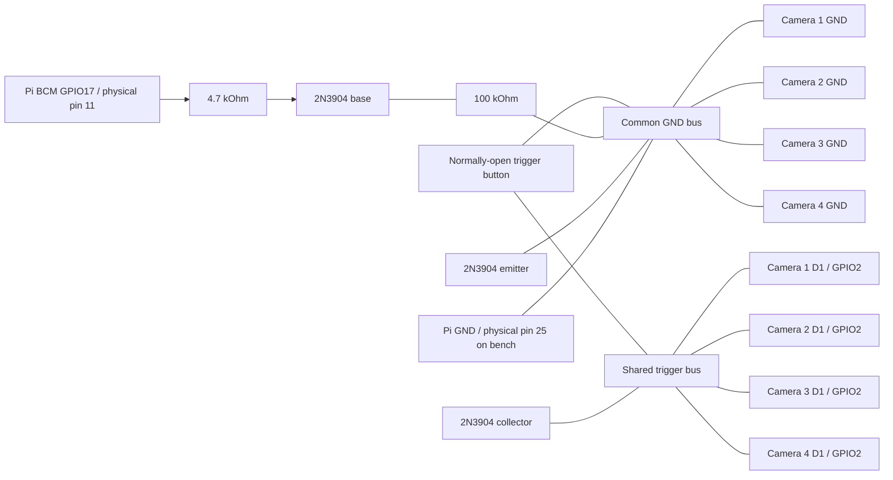

# Handheld Four-Camera Bullet-Time Rig

<p align="center">
  
</p>

This project is building a production-like, self-contained bullet-time camera: a fairly compact handheld device with four camera viewpoints, an integrated screen, a physical shutter button, a central processor, removable USB media storage, and an internal rechargeable battery.

Each camera is managed by its own Seeed Studio XIAO ESP32S3 Sense and OV3660 sensor. A central computer—currently expected to be a Raspberry Pi 4 Model B or similar—will collect each four-image capture, improve and align the images, and create an animated GIF that moves through the viewpoints. The central computer will also run the on-device interface and may eventually host a Wi-Fi hotspot for browsing and downloading finished media.

The first complete rig has four cameras spaced approximately 4 cm apart in a straight horizontal line and is held like a normal digital camera. Its typical subject distance is about 3.5 ft, although other distances should remain usable. The initial output will play the four nearly simultaneous photographs forward and backward, making the viewpoint appear to move while the scene remains frozen. A reviewable result should normally reach the built-in screen within two seconds.

The longer-term ideal is a scalable 12+ camera system. A larger array will use a slight curve to aim its outer cameras toward the subject. Later processing may add view alignment, appearance matching, AI frame interpolation, and experiments with NeRF or 3D Gaussian Splatting.

Version 1 deliberately performs no alignment or appearance normalization: it transfers the four original JPEGs, preserves them, creates the simple animated GIF, and preserves that GIF as well. Image-quality processing begins after the complete capture-to-display system works reliably.

The accepted version 1 display remains blank during the early Raspberry Pi kernel phase, then shows only `assets/Logo_800x480.png` and hands directly to the full-screen camera application without exposing firmware artwork, boot logs, a desktop, login prompt, cursor, or startup diagnostics. The application shows a capture/loading screen while a shot is in progress, then displays the completed animation until the next shot begins. It has no gallery, deletion controls, live preview, or user-adjustable camera settings. Live preview is the first planned follow-up; camera settings are deferred to version 2. The installed HDMI touchscreen runs at 800x480; the Pi reports a 150x100 mm physical area, while its micro-USB touch/power interface advertises 5 V / 100 mA maximum. This descriptor is not a measured whole-display load.

The Raspberry Pi boots from a protected internal microSD card. Original JPEGs, manifests, and generated GIFs are written below `BulletTime/` on a separate user-removable USB drive, keeping the operating system isolated from normal media handling. The application detects USB-backed filesystems and can request automatic mounting; it does not fall back to the boot card when USB storage is missing.

Version 1 requires an internal rechargeable battery and USB-C charging, but it does not need to operate while charging. One power button must safely boot and shut down the complete device. A low battery must initiate the same orderly shutdown before a brownout can corrupt storage or interrupt writes. Final battery capacity will be chosen after measuring the assembled system, with the goal of long runtime and many captures per charge.

The first enclosure will be a reasonably compact, box-shaped 3D print with openings for every externally accessible component. Refined ergonomics, weight optimization, integrated lighting, tripod mounting, and weather resistance are deliberately deferred until later physical revisions.

Version 1 degrades gracefully when a camera fails: it preserves and processes the images received from the remaining nodes instead of discarding the entire capture. The screen reports the failed camera number and relevant diagnostics. The two-second result goal is a soft normal-case target; the loading screen may remain longer while capture, transfer, or saving is actively progressing.

USB and Wi-Fi are the two candidate links between the camera nodes and central computer. USB is the leading option for the first four-camera build because of its predictable latency and reliability, while Wi-Fi remains an alternate path worth prototyping, especially for future scaling. The preferred final data path transfers each JPEG directly from node memory to the central computer instead of requiring four node microSD cards.

User-facing Wi-Fi features are deliberately much later. Hotspot-based media access, remote capture, status, and settings will wait until the self-contained onboard experience is highly polished.

The long-term product goal and current decisions are maintained in:

- [`docs/PROJECT_CONTEXT.md`](docs/PROJECT_CONTEXT.md)
- [`docs/INTERVIEW.md`](docs/INTERVIEW.md)
- [`docs/ROADMAP.md`](docs/ROADMAP.md)
- [`docs/MILESTONE_1_PLAN.md`](docs/MILESTONE_1_PLAN.md)
- [`docs/CURRENT_SESSION.md`](docs/CURRENT_SESSION.md) - Checkpoint 4 evidence and handoff to four-node product grouping
- [`docs/TRIGGER_CIRCUIT.md`](docs/TRIGGER_CIRCUIT.md) - approved shared-shutter and Raspberry Pi GPIO17 circuit
- [`docs/NEXT_SESSION_TRIGGER_REFACTOR_PROMPT.md`](docs/NEXT_SESSION_TRIGGER_REFACTOR_PROMPT.md) - paste-ready implementation handoff
- [`docs/RASPBERRY_PI_SSH.md`](docs/RASPBERRY_PI_SSH.md)
- [`docs/RASPBERRY_PI_BOOT_RUNBOOK.md`](docs/RASPBERRY_PI_BOOT_RUNBOOK.md) - reproduce, verify, recover, or roll back the accepted product boot state
- [`docs/FOUR_NODE_E2E_TEST_PLAN.md`](docs/FOUR_NODE_E2E_TEST_PLAN.md) - executable four-node acceptance contract, fault matrix, live ledger, and evidence gate

## Current Project State

As of July 17, 2026, with one-node vertical-slice, product-boot, revised firmware, and four-node hardware-trigger evidence recorded:

The original four-camera breadboard prototype demonstrated local card capture with individual node LEDs. Those features are historical and superseded by the July 17 node simplification; the earlier result remains valid prototype evidence but is not the current operating design.

- Four XIAO ESP32S3 Sense modules are fitted with OV3660 sensors.
- All four nodes share one physical shutter button.
- The boards are currently powered over USB from a battery hub.
- Firmware 0.2.0 is flashed and startup-verified on all four nodes. It leaves `D0 / GPIO1` unused and streams the JPEG directly from the camera frame buffer through BTC1 without node-local storage.
- The Raspberry Pi 4 Model B with 2 GB RAM has been imaged and boots Raspberry Pi OS successfully with the intended 800x480 HDMI display.
- Touch input on the intended display works.
- The accepted product boot path is visually verified: blank early boot, product logo, then the full-screen camera application, with no visible OS/debug text, desktop chrome, login prompt, or pointer.
- The display uses HDMI video and a micro-USB connection for touch and/or display-side power.
- The running Pi reports the display at 800x480, 65.681 Hz, and 150x100 mm, with USB touch controller `8888:6666` declaring 5 V / 100 mA maximum. Outer bezel/depth and real panel current are not available through software inventory.
- The final V1 USB hub/cabling is installed on the Pi and carries four concurrent ESP32 camera data links; four-node observers validated CRC-protected transfers from every stable UID. The enumerated chain is VIA Labs `2109:3431` feeding Terminus `1a40:0101`.
- A 3D printer is available for a later enclosure stage.
- The final integrated USB hub/cabling is selected and installed. The integrated battery system has not yet been selected. A USB storage drive has been added to the Raspberry Pi for user media.

The Pi application now selects writable USB-backed storage, asks `udisks2` to mount detected USB media when necessary, and fails visibly instead of writing captures to the boot microSD. The added 231 GB FAT drive enumerates as `/dev/sda1`, label `USB DISK`; the exact automatic-mount command succeeded from the camera user-service context and produced a writable `/media/username/USB DISK` mount. The new code has automated coverage but still needs Git deployment plus real JPEG/GIF capture and removal/failure testing on the Raspberry Pi. Raspberry Pi GPIO17 support for the 2N3904 circuit is installed and hardware-tested; the active service idles the pin output LOW. A physical press and normal touchscreen pulse each completed the earlier Camera 1 storage/display workflow and produced exactly one valid capture on all four nodes. A 10-cycle Pi-trigger run completed 40/40 four-node captures with zero errors or duplicates. The product owner subsequently completed the prescribed unpowered multimeter checklist and reported every check passing, closing that electrical gate; see [`docs/TRIGGER_CIRCUIT.md`](docs/TRIGGER_CIRCUIT.md).

The repository now contains the camera-node firmware plus a Raspberry Pi receiver/UI, CRC-protected USB protocol, USB-media discovery and atomic-storage path, instrumentation, 23 passing local Pi/protocol/fake-GPIO/storage/E2E-validator tests, an environment-gated physical-rig acceptance test, smoke-test and analytics tools, a user-service definition, and project logo assets under `assets/`. The one-node physical/Pi-trigger-to-touchscreen path works through the installed final hub. Multi-image GIF generation, product-level four-node grouping, execution of the live E2E ledger, real-drive removable-storage validation, internal power, and the handheld enclosure remain.

Milestone 1 Checkpoint 4 is complete. Normal touchscreen capture is one configured 100 ms GPIO17 pulse and sends no USB capture request; the USB command remains explicit diagnostic scaffolding only. Both physical and Pi hardware-trigger functional gates and the electrical inspection pass. Checkpoint 5 four-node product grouping and partial-failure handling are next. With approximately $200 remaining for version 1, battery and enclosure work remain deferred until the central path is working and measured.

Development is milestone-based with no fixed version 1 deadline.

The latest evidence includes a clean 20-capture one-node run, live corrupt-payload NACK/recovery, separate physical and Pi one-node display captures, and a 10-cycle four-node GPIO17 run with zero errors/duplicates. Repeated pulse-to-all-completions was 2.455 seconds median and 2.497 seconds maximum; maximum four-node start spread was 4.930 ms. Camera acquisition and USB transfer remain the main latency costs. See [`docs/CURRENT_SESSION.md`](docs/CURRENT_SESSION.md) and [`docs/evidence/milestone1-trigger-refactor-2026-07-17.md`](docs/evidence/milestone1-trigger-refactor-2026-07-17.md).

## Raspberry Pi Development Access

The current bench Pi is reachable over key-based SSH from the local Windows account configured for this project:

```powershell
ssh camerapi
```

The alias currently targets Pi hostname `camerapi`, LAN address `10.0.0.136`, and Linux user `username`. Strict host-key checking and a dedicated identity are configured in the Windows user's SSH profile. The private key is stored at `C:\Users\tyler\.ssh\camerapi_ed25519`, outside this repository; never copy it into the project or rely on `.gitignore` to protect it.

Local Codex agents running under the same Windows account can use the alias, subject to network approval. Other machines and cloud-hosted agents do not automatically receive the key. See [`docs/RASPBERRY_PI_SSH.md`](docs/RASPBERRY_PI_SSH.md) for the verified fingerprint, key-only test command, security boundary, and recovery/rotation procedure.

## Planned System

| Subsystem | Responsibility | State |
| --- | --- | --- |
| Four ESP32S3 camera nodes | Capture four initial viewpoints and report status | Working breadboard prototype |
| Shared shutter control | Start one coordinated capture | Working breadboard prototype |
| Central computer | Collect captures and coordinate the complete device | Raspberry Pi 4B validated for one-node vertical slice; four-node suitability remains provisional |
| Processing pipeline | Preserve originals and create the version 1 animation | One-image representative processing implemented; four-image GIF pending |
| Integrated screen and UI | V1 status and post-capture review; preview/settings later | One-node loading/review/error flow implemented; four-node integration pending |
| Central removable storage | Store user-accessible photos and GIFs | USB auto-detection/mount request and USB-only atomic persistence implemented; real-drive Pi validation pending |
| Internal battery system | Power and recharge the complete device | Planned |
| Wi-Fi media access | Let phones and laptops browse/download results | Optional later stage |
| Compact handheld enclosure | Turn the prototype into one finished physical product | Planned |
| Scalable camera array | Expand the architecture toward 12+ slightly curved viewpoints | Future |

## Current Camera-Node Firmware

The same Arduino sketch is flashed to all four camera nodes. It uses `D1 / GPIO2` with `INPUT_PULLUP` as the shared active-low trigger. `D0 / GPIO1` is unused. The firmware does not initialize or access a node card.

Each accepted trigger emits `CAPTURE_STARTED`, captures a 2048x1536 JPEG into the OV3660 frame buffer, and sends the bytes through the CRC-protected BTC1 USB protocol. The Pi validates and atomically preserves the original before ACK; NACK, corruption-test, stable eFuse UID, and reconnect behavior remain supported. A missing node card has no effect.

The legacy framed `CAPTURE_REQUEST` remains only as explicitly selected diagnostic scaffolding. Normal touchscreen capture uses the Pi's GPIO17/2N3904 hardware path, and the Pi learns that physical and Pi-initiated captures began from USB `CAPTURE_STARTED` events.

The Pi receiver/UI, protocol tests, runtime requirements, bounded serial smoke test, and user-service definition are under [`pi_app/`](pi_app/).

This gives practical same-button synchronization: all four boards see the same active-low trigger and start their capture sequence nearly together. It is not sensor-level hardware shutter sync; the OV3660 sensors still free-run independently, so exact exposure timing can vary by roughly a camera frame.

## Wiring Four Cameras

Flash the same sketch to all four modules.

Use a normally-open pushbutton between the shared `D1 / GPIO2` trigger bus and the common `GND` bus. The sketch enables the ESP32 internal pull-up on every board, so no external resistor is required for the trigger. Four internal pull-ups in parallel are still light enough for a normal pushbutton.

Connect all four board grounds and Raspberry Pi ground together. This common ground is required for both the physical button and the Pi-controlled transistor stage, even when the devices are powered through USB.

### Circuit Summary

| Net | Connects To | Notes |
| --- | --- | --- |
| `TRIGGER` | All four `D1 / GPIO2` pins and one side of the pushbutton | Idle `HIGH` through each board's internal pull-up |
| `GND` | All four camera grounds, Pi ground, transistor emitter, bottom of the 100 kOhm resistor, and the other side of the pushbutton | Required shared logic reference |
| `PI_TRIGGER` | Pi BCM GPIO17 / physical pin 11 through 4.7 kOhm to the 2N3904 base | Pi idles low and pulses high for 100 ms |
| `BASE_PULLDOWN` | 100 kOhm from 2N3904 base to common ground | Keeps the transistor off during Pi boot/high-impedance states |
| `OPEN_COLLECTOR` | 2N3904 collector to `TRIGGER`; emitter to `GND` | Pulls the bus low without the Pi driving it high |
| `5V` power | Each board's USB-C port or each board's `5V` pin from one regulated supply | Keep `3V3` rails separate unless you have a deliberate shared-power design |



- Trigger unpressed reads `HIGH`.
- Trigger pressed reads `LOW`.
- Keep the trigger wiring short or route it as a twisted pair with ground if the cameras are spread out.
- If one board is powered off while the others are on, disconnect it from the trigger bus or power all boards together to avoid weak backfeed through GPIO protection paths.
- Do not tie the `3V3` rails together when boards are powered from separate USB cables.
- If using one external supply, use a regulated 5V supply sized for all four boards and wire 5V/GND in a star layout rather than daisy-chaining through the boards.
- Do not connect Raspberry Pi GPIO17 directly to the trigger bus. It connects only to the transistor base through 4.7 kOhm.
- Leave each camera's `D0 / GPIO1` unconnected; it has no assigned function.
- Confirm the actual 2N3904 emitter/base/collector pin order for the specific manufacturer before applying power.
- See [`docs/TRIGGER_CIRCUIT.md`](docs/TRIGGER_CIRCUIT.md) for multimeter checks and staged bench validation.

### Four-Board Checklist

- Flash this same sketch to Camera 1, Camera 2, Camera 3, and Camera 4.
- Connect all four `D1 / GPIO2` pins to the same trigger bus.
- Connect the trigger pushbutton between the trigger bus and common ground.
- Connect all four `GND` pins to the common ground bus.
- Connect the 2N3904 collector to the trigger bus and emitter to common ground.
- Connect Pi BCM GPIO17 through 4.7 kOhm to the transistor base, and connect 100 kOhm from that base junction to common ground.
- Connect Pi ground to the common ground bus.
- Power all four boards before pressing the trigger.

## Load With Arduino IDE

1. Install Arduino IDE 2.x.
2. Open `File > Preferences`.
3. Add this Boards Manager URL:
   `https://raw.githubusercontent.com/espressif/arduino-esp32/gh-pages/package_esp32_index.json`
4. Open `Tools > Board > Boards Manager`, search for `esp32`, and install Espressif `esp32` version `2.0.8` or newer.
5. Select `Tools > Board > esp32 > XIAO_ESP32S3`.
6. Enable PSRAM in the board/tool settings.
7. Select the XIAO serial port.
8. Open `button_capture/button_capture.ino`.
9. Upload the sketch, then open Serial Monitor at `115200`.
10. Start the Pi receiver, then press the shared trigger button. Each board emits `CAPTURE_STARTED`, captures one JPEG, and transfers it directly from the frame buffer over USB. No node card is read or written.

## Build And Upload With Arduino CLI

These commands are for Windows PowerShell. They build and upload the `button_capture` sketch with OPI PSRAM enabled, which is required for high-resolution camera captures.

If Arduino CLI is installed in the user-local CodexTools path used for this project:

```powershell
$ArduinoCli = "$env:LOCALAPPDATA\CodexTools\arduino-cli\arduino-cli.exe"
```

If Arduino CLI is installed globally and already on `PATH`, use this instead:

```powershell
$ArduinoCli = "arduino-cli"
```

Set the board package URL, board target, and sketch path:

```powershell
$Esp32Url = "https://raw.githubusercontent.com/espressif/arduino-esp32/gh-pages/package_esp32_index.json"
$Fqbn = "esp32:esp32:XIAO_ESP32S3:PSRAM=opi"
$Sketch = ".\button_capture"
```

Install or update the ESP32 Arduino core:

```powershell
& $ArduinoCli core update-index --additional-urls $Esp32Url
& $ArduinoCli core install esp32:esp32 --additional-urls $Esp32Url
```

Discover the connected board port:

```powershell
& $ArduinoCli board list
[System.IO.Ports.SerialPort]::GetPortNames()
```

If no COM port appears, unplug the XIAO, hold `BOOT`, plug USB back in, release `BOOT`, then run the port discovery commands again.

Build the sketch:

```powershell
& $ArduinoCli compile --fqbn $Fqbn $Sketch
```

Upload the sketch, replacing `COM3` with the port found above:

```powershell
$Port = "COM3"
& $ArduinoCli upload -p $Port --fqbn $Fqbn $Sketch
```

Open the serial monitor:

```powershell
& $ArduinoCli monitor -p $Port -c baudrate=115200
```

Optional PlatformIO port discovery, if PlatformIO is installed:

```powershell
$Pio = "$env:LOCALAPPDATA\CodexTools\platformio-venv\Scripts\pio.exe"
& $Pio device list
```

### Deploy With the Repository Skill

Codex can use the repo-scoped `$deploy-xiao-esp32s3-sense` skill to discover one attached ESP32 device, compile with the required OPI PSRAM setting, upload the sketch, and verify camera readiness, BTC1 protocol/stable identity, and trigger readiness over serial.

The bundled helper can also be run directly from the repository root:

```powershell
powershell -NoProfile -ExecutionPolicy Bypass -File ".agents\skills\deploy-xiao-esp32s3-sense\scripts\deploy_xiao.ps1"
```

Pass `-Port COM6` when more than one ESP32 serial device is attached. A successful upload is not treated as a complete deployment unless the serial startup checks also pass.

## Image Quality Notes

- The sketch captures the OV3660's native 4:3 `2048x1536` frame. Crop or downsample the saved JPEG on a computer if you need a cleaner `1920x1080` final image.
- `JPEG_QUALITY` is set to `8`; in the ESP32 camera driver, lower numbers mean less JPEG compression and larger files.
- The capture path uses one frame buffer, waits `700 ms`, discards four warm-up frames, then saves the next frame so exposure and white balance have time to settle.
- Sensor denoise, mild sharpening, defect correction, gamma, auto white balance, and auto exposure are enabled. Gain is capped at `GAINCEILING_4X` to reduce noise.
- If photos are too dark after the gain cap, add more steady diffuse light first. If that is not possible, try `GAINCEILING_8X`, but expect more grain.
- Clean the lens, remove any protective film, and keep the camera rigidly mounted while capturing.
- Use stable 5V power for all four boards; high-resolution capture and concurrent USB transfer can be current-sensitive.

## Expected Serial Output

On successful boot:

```text
XIAO ESP32S3 Sense 4-Camera Shared Trigger
Initializing camera...
Camera ready: 2048x1536 JPEG, quality 8.
USB protocol ready: BTC1 v1, node UID E072A1F9A190.
Ready. Pull the shared trigger LOW to capture.
```

## Validation

- On every boot, require camera-ready, BTC1 identity, and trigger-ready evidence.
- Press once: every connected node must emit exactly one `CAPTURE_STARTED` and transfer exactly one 2048x1536 JPEG.
- Hold the trigger: the existing debounce must still produce only one capture per board for that press.
- Use a normal touchscreen capture: GPIO17 must produce one 100 ms pulse and no USB `CAPTURE_REQUEST`.
- Validate CRC/length/decode before each Pi-side atomic commit; do not accept truncated or corrupt files.
- Press repeatedly: identities remain stable, no originals are overwritten, and no duplicate capture is observed.
- If one board misses a trigger, check that its `D1 / GPIO2` pin joins the same trigger bus and that its `GND` pin joins the common ground bus.
