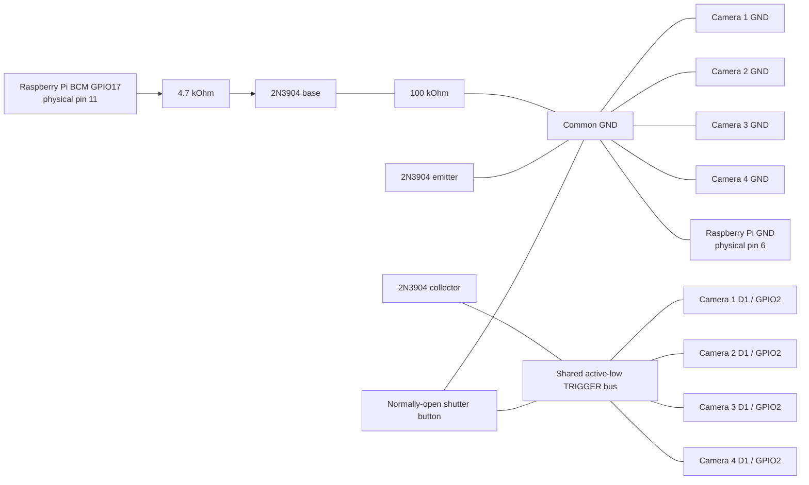

# Shared Trigger and Raspberry Pi Control Circuit

Status: approved hardware design; Raspberry Pi GPIO control and the camera-node LED/microSD removal are pending implementation and bench validation.

## Design Intent

The version 1 trigger system has two ways to start the same four-camera capture:

1. A normally-open physical shutter button pulls the shared active-low trigger bus to ground.
2. Raspberry Pi BCM GPIO17 drives a 2N3904 NPN transistor, which acts as an open-collector pull-down on that same bus.

The Raspberry Pi does not need a separate GPIO input to observe the shutter. Each camera node reports `CAPTURE_STARTED` over its USB data connection, and the Pi enters its loading state when the first event arrives. A Pi-initiated capture must pulse the hardware trigger only; it must not also send a USB `CAPTURE_REQUEST` for the same user action.

## Assigned Pins

| Device | Pin | Direction | Purpose |
| --- | --- | --- | --- |
| Each XIAO ESP32S3 Sense | `D1 / GPIO2` | Input with internal pull-up | Shared active-low trigger |
| Each XIAO ESP32S3 Sense | `GND` | Ground | Common trigger reference |
| Raspberry Pi 4 | BCM `GPIO17`, physical pin 11 | Output | Drives the transistor base through 4.7 kOhm |
| Raspberry Pi 4 | Physical pin 6 or another `GND` pin | Ground | Common trigger reference |
| Each XIAO `D0 / GPIO1` | Unused after the pending firmware revision | - | No camera-node status LED |

## Components

- One normally-open momentary shutter button
- One 2N3904 NPN transistor
- One 4.7 kOhm resistor between Pi GPIO17 and the transistor base
- One 100 kOhm resistor between the transistor base and common ground
- Breadboard wiring for the bench prototype

The 2N3904 is used as an open-collector switch:

- Emitter -> common ground
- Base -> junction of the 4.7 kOhm and 100 kOhm resistors
- Collector -> shared trigger bus

The common ground includes the transistor emitter, bottom of the 100 kOhm resistor, Pi ground, all four camera grounds, and the ground side of the physical shutter button. Confirm the transistor manufacturer's actual pin order before applying power; do not rely only on a generic TO-92 drawing.

## Wiring Diagram

Each camera remains connected to the powered USB hub for protocol messages and JPEG transfer. USB is the notification/data path; the shared bus is the simultaneous hardware capture path.

## Required Electrical Behavior

- The camera firmware configures `D1 / GPIO2` as `INPUT_PULLUP`.
- The trigger bus idles high through the four ESP32S3 internal pull-ups.
- Pressing the shutter pulls the trigger bus low.
- Pi GPIO17 idles low. The 100 kOhm base pull-down keeps the transistor off during boot and whenever the GPIO is high-impedance.
- A Pi capture command drives GPIO17 high for 100 ms, then returns it low. The transistor inverts that into a low pulse on the trigger bus.
- The Pi GPIO must never connect directly to the shared trigger bus and must never drive that bus high.
- Do not connect any `5V` or `3V3` rail to the trigger bus.
- Power all camera nodes together, or disconnect an unpowered node from the trigger bus to avoid GPIO backfeed.

## Bench Validation

Before connecting the Pi or cameras, test the unpowered breadboard with a multimeter:

- Emitter, bottom of the 100 kOhm resistor, Pi ground connection, camera ground connections, and button ground must have continuity.
- Collector must have continuity to the shared trigger bus.
- GPIO17 connection must measure approximately 4.7 kOhm to the base junction.
- Base junction must measure approximately 100 kOhm to ground, subject to in-circuit transistor-junction effects.
- Trigger to ground must be open with the button released and near zero ohms with it pressed.
- Trigger to the proposed Pi GPIO connection must not be a direct short.

Then validate in stages:

1. Connect one camera only and confirm one physical press produces one capture.
2. Connect all four cameras and confirm one physical press produces one capture per node.
3. Connect the Pi GPIO circuit after its software initializes GPIO17 low.
4. Confirm a 100 ms Pi pulse produces one capture per node without a duplicate USB request.
5. Confirm physical and Pi-initiated captures both generate USB `CAPTURE_STARTED` events and complete the Pi storage/display path.
